# Adaptive Position Sizing and Regime Detection in Trading Systems

## Project Overview

This project investigates how a trader should learn and size positions to manage risk under uncertainty, particularly in environments where the underlying edge may change over time.

To study this in a controlled setting, I begin with a simple simulation framework based on repeated coin flips. Each flip represents a trade, where outcomes (“Heads” or “Tails”) correspond to profit and loss signals. The true probability of success is unknown and must be inferred from sequential observations.

Using **Monte Carlo simulation**, I run many independent paths to evaluate strategy performance in terms of:
    - wealth growth
    - drawdowns
    - robustness across different scenarios

We develop the project from a simple static idea into increasingly adaptive strategies.

The project initially utilises a static fixed-fraction strategy, where sizing does not respond to outcomes.

Next, I introduce Bayesian sequential learning, with a discrete prior over possible probabilities, and later extending this to a continuous Beta distribution. This allows the model to update its belief about the underlying edge after each observation in a more realistic way.

Building on this, I implement fractional Kelly position sizing, linking belief updates directly to capital allocation.

To capture more realistic trading dynamics , I then introduce a regime change, where the true probability shifts from a strong positive edge to a no-edge environment. This creates a non-stationary setting in which strategies must balance responsiveness and stability.

To address this, I develop:
    - Rolling-window estimator (fast but noisy)
    - Bayesian estimator (stable but slow)
    - Hybrid model that combines both approaches

Finally, I incorporate a regime detection mechanism, where divergence between models is used as a signal to reduce position sizes in order to limit drawdowns.

---

## Static Strategies

### Sharpe-like Heatmaps (D1)

Heatmaps show how performance varies across stopping thresholds:

### Sharpe Heatmap (true_p = 0.55)
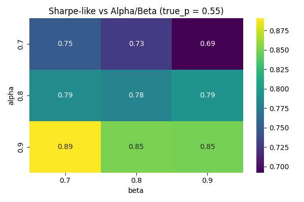

### Sharpe Heatmap (true_p = 0.60)
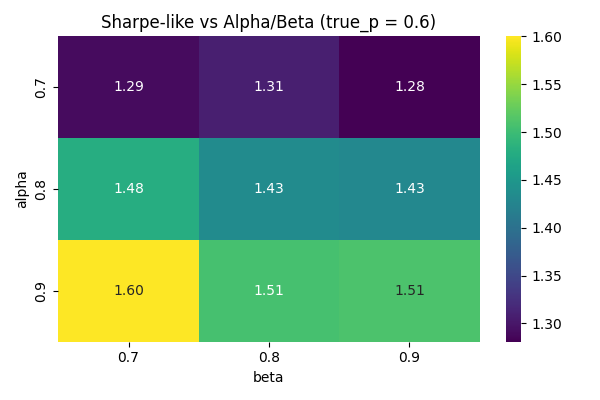

### Sharpe Heatmap (true_p = 0.65)
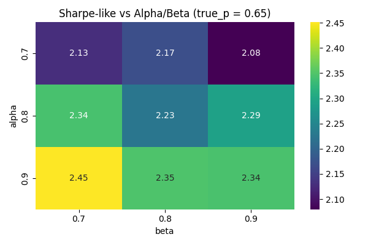

Insight:
- Conservative stopping (high alpha) improves survivability
- Weak edges require looser stopping to avoid premature exit

### Detection (D2)

### Detection Time vs True Edge
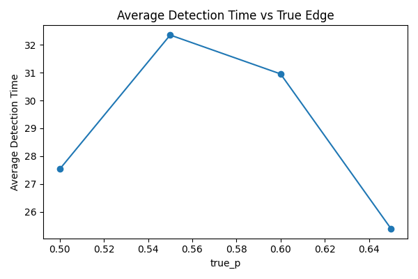

### Detection Rate vs True Edge
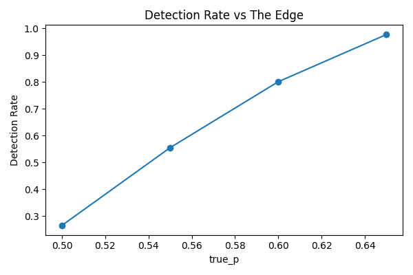

Insights:
- Stronger edges → faster detection
- Weak edges → high noise → slow learning
- Detection reliability improves sharply as edge increases

### Key Insights

---

## Adaptive Estimations

### Kelly (Fractional) vs Fixed Sizing (D3)
 
We directly compare strategies:
Sharpe Difference = Kelly - Fixed
Drawdown Difference = Kelly - Fixed

### Sharpe Difference (Kelly - Fixed)

| true_p = 0.50 | true_p = 0.55 |
|--------------|--------------|
| 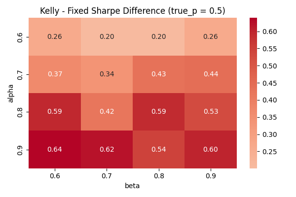 | 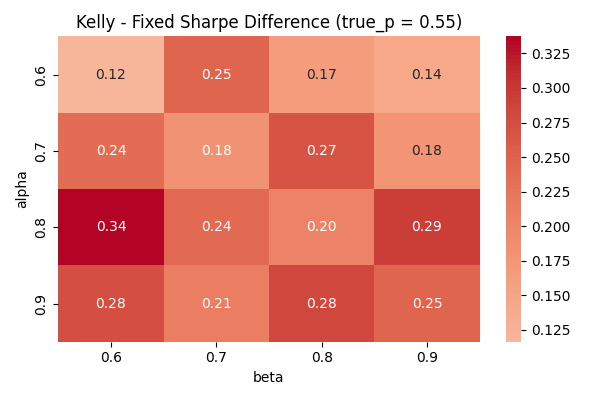 |

| true_p = 0.60 | true_p = 0.65 |
|--------------|--------------|
| 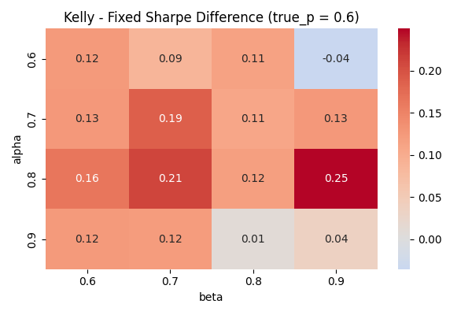 | 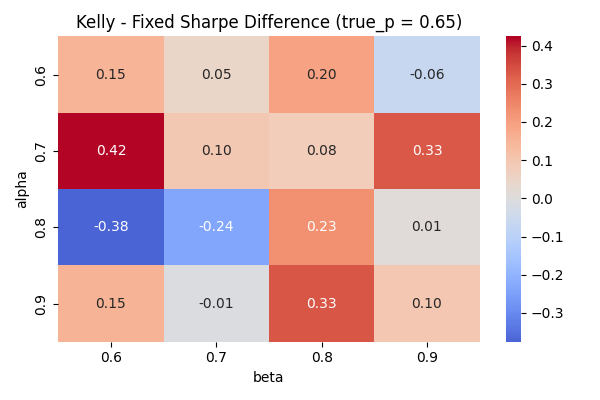 |

### Drawdown Difference (Kelly - Fixed)

| true_p = 0.50 | true_p = 0.55 |
|--------------|--------------|
| 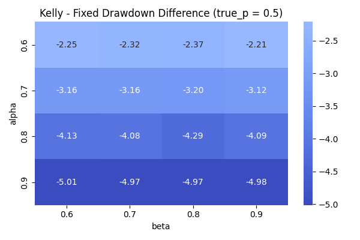 | 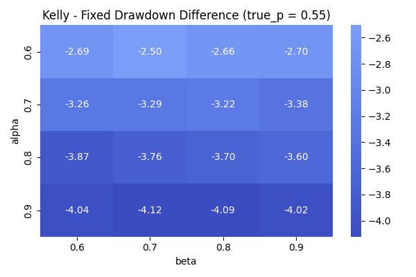 |

| true_p = 0.60 | true_p = 0.65 |
|--------------|--------------|
| 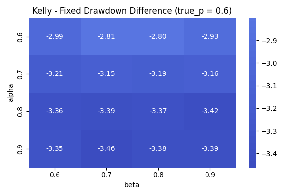 | 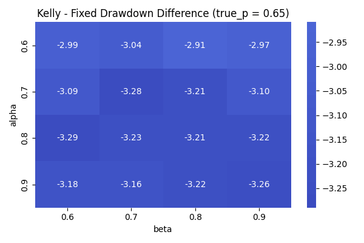 |

- Fractional Kelly sizing (0.5× Kelly) improves Sharpe-like performance when the trading edge is sufficiently strong, as position size scales with posterior confidence and efficiently exploits high-probability opportunities

- Under weak-edge regimes, fixed sizing can outperform in Sharpe-like terms, since fractional Kelly reduces exposure when beliefs are uncertain, limiting both gains and losses

- Fractional Kelly produces **lower drawdowns than fixed sizing** in this framework, as it adaptively reduces position size during periods of uncertainty and early noise

- Fixed sizing incurs larger drawdowns in weak-edge environments, since it maintains constant exposure regardless of signal strength or confidence

- The advantage of fractional Kelly increases with signal-to-noise ratio: as the true edge strengthens, posterior estimates stabilise faster, allowing Kelly to scale exposure more effectively

- Fractional Kelly acts as an implicit risk control mechanism, avoiding overbetting when edge estimates are noisy and increasing exposure only when sufficient evidence is accumulated

- Overall, the trade-off is between:
  - **Adaptive growth (fractional Kelly)**: higher efficiency when signal is reliable  
  - **Robust simplicity (fixed sizing)**: stable but less responsive to changing confidence

### Beta Distribution (D4)

### Regime Change (D5)

### Adaptation (D6)

### Key Insights

---

## Hybrid Models (D7)

### Key Insights

--

## Regime Detection & Control (D8)

### Key Insights

-- 

## Limitations

--

## Tech Stack
- Python
- NumPy
- Pandas
- Matplotlib / Seaborn / Scipy

---
