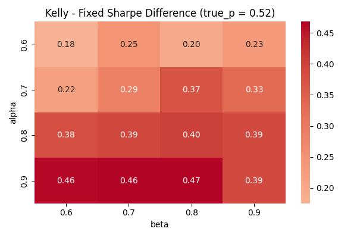
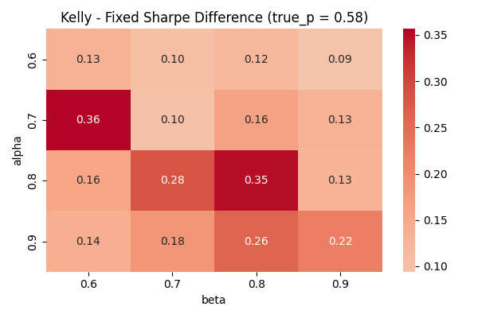
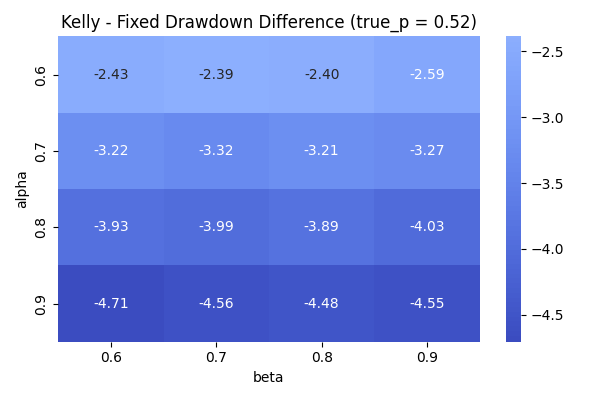
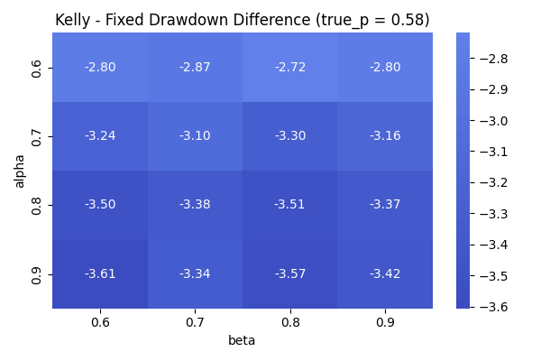

# Sequential Bayesian Trading Strategy Simulator

## Overview

This project investigates how a trader should learn, size positions, and decide when to stop trading under uncertainty.

We simulate a simple trading environment (biased coin) and explore:
- Bayesian belief updating of edge
- Sequential stopping rules (Type I vs Type II error tradeoff)
- Position sizing strategies (Fixed vs Fractional Kelly-style sizing)

The goal is to understand how edge strength, confidence thresholds, and sizing rules interact to impact:
- Profitability (Sharpe-like performance)
- Risk (drawdowns)
- Speed of detecting a true edge


---

## Methodology

### 1. Bayesian Learning Framework

We assume the true edge p is unknown and maintain a discrete prior over possible values:

```python
ps = [0.5, 0.55, 0.60, 0.65]
prior = [0.4, 0.2, 0.2, 0.2]
```

Beliefs are updated after each trade using likelihood weighting:
- Heads → weight by p
- Tails → weight by 1 - p

```python
def update_belief(belief: list[float], outcome: str, ps: list[float]) -> list[float]:
    new_weights = []
    for w,p in zip(belief, ps):
        if outcome ==  "H":
            likelihood = p
        else: likelihood = 1-p
        new_weights.append(likelihood * w)
    return normalise_weights(new_weights)
```

### 2. Trading Decisions

Stopping Rule (Sequential Testing)
We stop trading if:
- Probability edge is “bad” exceeds threshold "alpha"

This captures:
- Type I error → stopping too early (missing real edge)
- Type II error → continuing in a bad strategy

Detection Rule
We detect a “good edge” when:
- Probability p > 0.5 exceeds threshold "beta"

This measures speed of learning / signal detection


### 3. Position Sizing Strategies

Fixed Sizing
- Discrete actions: No trade / Half size / Full size
- Based on posterior mean p_hat

Fractional Kelly-Style Sizing
- f = max(0, 2*p_hat - 1)
- Scales position size continuously with confidence
- More aggressive when edge is strong
- More conservative when uncertain


### 4. Simulation Setup

For each configuration:
- 100 trades per run
- 300–1000 Monte Carlo simulations
- Parameter sweep over:
    - alpha in {0.6, 0.7, 0.8, 0.9}
    - beta in {0.6, 0.7, 0.8, 0.9}
    - p in {0.50, 0.52, 0.55, 0.58, 0.60, 0.65}

Metrics tracked:
- Mean wealth
- Sharpe-like ratio
- Maximum drawdown
- Detection time
- Detection rate


---

## Results

### Parameter Sensitivity (D1)
Heatmaps show how performance varies across stopping thresholds:

### Sharpe Heatmap (true_p = 0.55)


### Sharpe Heatmap (true_p = 0.60)


### Sharpe Heatmap (true_p = 0.65)


Insight:
- Conservative stopping (high alpha) improves survivability
- Weak edges require looser stopping to avoid premature exit

### Detection Speed vs Edge (D2)

### Detection Time vs True Edge


### Detection Rate vs True Edge


Insights:
- Stronger edges → faster detection
- Weak edges → high noise → slow learning
- Detection reliability improves sharply as edge increases
  
### Kelly (Fractional) vs Fixed Sizing (D3)
We directly compare strategies:
Sharpe Difference = Kelly - Fixed
Drawdown Difference = Kelly - Fixed












### Key Insights
- Fractional Kelly sizing (0.5× Kelly) improves Sharpe-like performance when the trading edge is sufficiently strong, as position size scales with posterior confidence and efficiently exploits high-probability opportunities

- Under weak-edge regimes, fixed sizing can outperform in Sharpe-like terms, since fractional Kelly reduces exposure when beliefs are uncertain, limiting both gains and losses

- Fractional Kelly produces **lower drawdowns than fixed sizing** in this framework, as it adaptively reduces position size during periods of uncertainty and early noise

- Fixed sizing incurs larger drawdowns in weak-edge environments, since it maintains constant exposure regardless of signal strength or confidence

- The advantage of fractional Kelly increases with signal-to-noise ratio: as the true edge strengthens, posterior estimates stabilise faster, allowing Kelly to scale exposure more effectively

- Fractional Kelly acts as an implicit risk control mechanism, avoiding overbetting when edge estimates are noisy and increasing exposure only when sufficient evidence is accumulated

- Overall, the trade-off is between:
  - **Adaptive growth (fractional Kelly)**: higher efficiency when signal is reliable  
  - **Robust simplicity (fixed sizing)**: stable but less responsive to changing confidence


---

## Tech Stack
- Python
- NumPy
- Pandas
- Matplotlib / Seaborn


---
